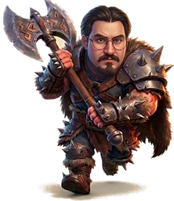
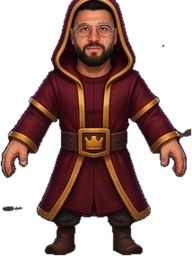
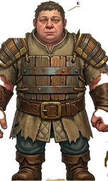
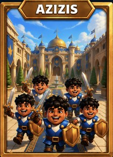

# Kartenwerkstatt

> **Status: Abschnitt 3 ist ein REFERENZ-Vorschlag, kein Beschluss.**
> Der finale Roster wird in **Abschnitt 7** gemeinsam entworfen — eigene Karten.
> Diese Datei ist die einzige Quelle der Wahrheit für alle Karten-Stats.
> Aus ihr entsteht später `src/data/cards.js` 1:1.
>
> Alle Namen und Symbole sind Eigenentwicklung. Kein Bezug zu bestehenden Produkten,
> nur die Spielmechanik dient als Vorbild.

## Beschlüsse bisher

| Datum | Beschluss |
|---|---|
| — | ✅ Extra-Mechaniken **bestätigt**: ❄️ Einfrieren (Statuseffekt), ☄️ Rückstoß, 🎈 Todesexplosion |
| — | ❌ 🕳️ Rattenhöhle (Gebäude spawnt Einheiten) **verworfen** — Mechanik kommt nicht in die Engine |
| — | 🔨 Roster wird **selbst entworfen**, Abschnitt 3 dient nur als Maßstab für Stat-Größenordnungen |
| — | 🗑️ Vorschlags-Roster (Abschnitt 3) wird **vollständig ersetzt** — keine der 18 Karten kommt ins Spiel |
| — | 📏 Roster-Größe **offen** — wir sammeln, ich melde Lücken und Überschneidungen |
| — | 🎨 **Kein festes Setting** — Stilmix erlaubt |
| — | 🐌 Ablauf: **eine Karte pro Runde**, ich liefere Stats + Konter-Einordnung zurück |

---

## 1. Stat-Modell

Jede Karte ist ein Datensatz mit diesen Feldern:

| Feld | Bedeutung |
|---|---|
| `id` | Interner Schlüssel, z.B. `steinwaechter` |
| `name` | Anzeigename |
| `emoji` | Symbol im Kreis auf dem Feld und auf der Handkarte |
| `cost` | Elixierkosten 1–9 |
| `kind` | `troop` \| `spell` \| `building` |
| `count` | Wie viele Einheiten pro Karte erscheinen (Schwarm) |
| `hp` | Lebenspunkte **pro Einheit** |
| `damage` | Schaden **pro Treffer** |
| `hitSpeed` | Sekunden zwischen zwei Angriffen |
| `range` | Reichweite in Kacheln (Nahkampf = 1.2) |
| `speed` | Bewegung in Kacheln pro Sekunde |
| `layer` | `ground` \| `air` — wo die Einheit selbst ist |
| `targets` | `ground` \| `air` \| `both` \| `buildings` — was sie angreifen darf |
| `splash` | Radius für Flächenschaden in Kacheln (0 = Einzelziel) |
| `lifetime` | Nur Gebäude: Sekunden bis zum Selbstabbau |
| `deployTime` | Sekunden vom Platzieren bis handlungsfähig (Standard 1.0) |

**Tempo-Stufen:** langsam `0.7` · mittel `1.0` · schnell `1.4` · sehr schnell `1.8` Kacheln/s
**Arena:** 18 Kacheln breit, 32 hoch. Eine mittlere Einheit läuft die halbe Arena in ~16 s.

### Wert-Faustregel für die Balance

Ein Elixier ist ungefähr wert:
- **≈ 380 effektive HP** *oder*
- **≈ 60 DPS**

Eine Karte, die beides bekommt, muss dafür woanders bezahlen (langsam, kurze Reichweite,
kann keine Luftziele treffen, greift nur Gebäude an). Genau diese Schwächen sind das,
was Deckbau interessant macht — deshalb hat unten **keine** Karte nur Vorteile.

---

## 2. Die Türme (keine Karten, aber sie brauchen Stats)

| Turm | HP | Schaden | Angriff alle | DPS | Reichweite | Ziele |
|---|---|---|---|---|---|---|
| **Wachturm** (2× pro Seite) | 2400 | 90 | 0.8 s | 112 | 7.5 | Boden + Luft |
| **Königsturm** (1× pro Seite) | 4000 | 110 | 1.0 s | 110 | 7.0 | Boden + Luft |

Der Königsturm **schläft** zu Beginn. Er erwacht, wenn ein eigener Wachturm fällt
*oder* wenn er selbst Schaden nimmt (z.B. durch einen Zauber). Königsturm zerstört = Match sofort vorbei.

---

## 3. REFERENZ-Roster — kommt NICHT ins Spiel

> ⚠️ Diese 18 Karten wurden **verworfen** und werden vollständig durch eigene ersetzt.
> Sie bleiben nur als **Maßstab** stehen: Woran man ablesen kann, welche HP-, DPS-
> und Reichweiten-Größenordnungen bei welchen Elixierkosten ausgewogen sind.
> Der echte Roster steht in Abschnitt 7.

### 3.1 Nahkampf & Tanks (Boden)

| # | Karte | Kosten | Anzahl | HP | Schaden | Angriff alle | DPS | Rw | Tempo | Ziele | Rolle |
|---|---|---|---|---|---|---|---|---|---|---|---|
| 1 | 🗿 **Steinwächter** | 5 | 1 | 3200 | 220 | 1.5 s | 147 | 1.2 | langsam | Boden | Der Panzer. Läuft vorne, saugt Turmschaden. Kann keine Luftziele treffen. |
| 2 | 🗡️ **Klingenwache** | 3 | 1 | 1400 | 160 | 1.2 s | 133 | 1.2 | mittel | Boden | Allrounder-Verteidigerin, gutes Preis-Leistungs-Verhältnis. |
| 3 | 🐗 **Rammbock** | 4 | 1 | 1900 | 300 | 1.5 s | 200 | 1.2 | schnell | **nur Gebäude** | Siegbedingung. Ignoriert alle Truppen und rennt auf den Turm zu. |

### 3.2 Schwarm (Boden)

| # | Karte | Kosten | Anzahl | HP je | Schaden | Angriff alle | DPS je | Rw | Tempo | Ziele | Rolle |
|---|---|---|---|---|---|---|---|---|---|---|---|
| 4 | 🐀 **Rattenrudel** | 1 | 4 | 90 | 60 | 0.9 s | 67 | 1.2 | sehr schnell | Boden | Billigster Zykel. Stoppt einen Tank für zwei Sekunden, stirbt an jedem Zauber. |
| 5 | 🔪 **Straßenbande** | 2 | 3 | 220 | 105 | 1.1 s | 95 | 1.2 | schnell | Boden | 285 DPS gebündelt — der beste Einzelziel-Konter im Spiel. |
| 6 | 🪃 **Speerbrüder** | 2 | 3 | 130 | 60 | 1.1 s | 55 | 5.0 | mittel | Boden + Luft | Billige Reichweite, trifft auch Luft. Extrem zerbrechlich. |

### 3.3 Fernkampf (Boden)

| # | Karte | Kosten | Anzahl | HP je | Schaden | Angriff alle | DPS | Rw | Tempo | Ziele | Rolle |
|---|---|---|---|---|---|---|---|---|---|---|---|
| 7 | 🏹 **Bogenschützinnen** | 3 | 2 | 300 | 95 | 1.2 s | 79 | 5.5 | mittel | Boden + Luft | Solide Dauerschaden-Basis hinter einem Tank. |
| 8 | 🔥 **Feuermagier** | 4 | 1 | 620 | 250 | 1.6 s | 156 | 5.5 | mittel | Boden + Luft | **Splash 1.3** — löscht ganze Schwärme aus. Der Anti-Schwarm-Anker. |
| 9 | 🔭 **Fernrohrschützin** | 4 | 1 | 420 | 400 | 2.4 s | 167 | **9.0** | langsam | Boden + Luft | Größte Reichweite im Spiel, kann Türme aus sicherer Distanz treffen. Sehr langsame Angriffe. |

### 3.4 Lufteinheiten

| # | Karte | Kosten | Anzahl | HP je | Schaden | Angriff alle | DPS | Rw | Tempo | Ziele | Rolle |
|---|---|---|---|---|---|---|---|---|---|---|---|
| 10 | 🦅 **Sturmfalke** | 4 | 1 | 900 | 140 | 1.4 s | 100 | 2.5 | mittel | Boden + Luft | **Splash 1.2**. Fliegt über den Fluss, ignoriert Brücken. |
| 11 | 🦇 **Fledermausschwarm** | 2 | 5 | 70 | 55 | 0.9 s | 61 | 1.2 | sehr schnell | Boden + Luft | 305 DPS für 2 Elixier — stirbt aber komplett an jedem Flächenschaden. |
| 12 | 🎈 **Glockenballon** | 5 | 1 | 1700 | 700 | 3.0 s | 233 | 1.5 | langsam | **nur Gebäude** | Zweite Siegbedingung, aus der Luft. **Todesexplosion: 300 Schaden, Radius 2.0** |

### 3.5 Zauber

| # | Karte | Kosten | Radius | Schaden | vs. Türme | Extra |
|---|---|---|---|---|---|---|
| 13 | 🌧️ **Splitterregen** | 3 | 3.5 | 250 | 88 (35 %) | Größter Radius. Räumt Schwärme ab, trifft auch Luft. |
| 14 | ☄️ **Feuerball** | 4 | 2.5 | 600 | 210 (35 %) | Stößt getroffene Einheiten kurz zurück. |
| 15 | ⚡ **Blitzschlag** | 5 | 1.8 | 900 | 315 (35 %) | Kleinster Radius, tötet einzelne teure Ziele und Gebäude. |
| 16 | ❄️ **Frostwelle** | 2 | 3.0 | 80 | 28 (35 %) | Friert getroffene Einheiten **2.5 s** ein — kein Laufen, kein Angreifen. |

> **Warum Zauber nur 35 % gegen Türme?** Sonst wäre reines „Türme wegzaubern" eine
> Gewinnstrategie ohne Truppen. Die Reduktion zwingt dazu, Zauber als *Werkzeug* für
> einen Truppen-Angriff zu benutzen, statt als Angriff selbst.

### 3.6 Gebäude

| # | Karte | Kosten | HP | Schaden | Angriff alle | DPS | Rw | Lebensdauer | Ziele | Rolle |
|---|---|---|---|---|---|---|---|---|---|---|---|
| 17 | 🏯 **Speerturm** | 4 | 1050 | 110 | 0.9 s | 122 | 6.5 | 35 s | Boden + Luft | Defensivgebäude. Zieht Rammbock & Ballon von den Türmen weg. |
| 18 | 🧱 **Bollwerk** | 3 | 2200 | — | — | — | — | 30 s | — | Greift nicht an, hat nur HP. Reine Ablenkung, extrem billig pro HP. |

### 3.7 Verworfen

~~🕳️ **Rattenhöhle** (5💧, Gebäude spawnt alle 5 s zwei Einheiten)~~ — abgelehnt.
Die Mechanik „Gebäude erzeugt Einheiten" wird **nicht** in die Engine gebaut.

---

## 4. Elixierkurve des Rosters

| Kosten | Anzahl | Karten |
|---|---|---|
| 1 | 1 | 🐀 |
| 2 | 4 | 🔪 🪃 🦇 ❄️ |
| 3 | 4 | 🗡️ 🏹 🌧️ 🧱 |
| 4 | 6 | 🐗 🔥 🔭 🦅 ☄️ 🏯 |
| 5 | 3 | 🗿 🎈 ⚡ |

Damit lässt sich sowohl ein billiges Zykel-Deck (Ø 2.8) als auch ein schweres
Tank-Deck (Ø 4.2) bauen — ein 8er-Deck mit Ø 3.2–3.8 ist der gesunde Mittelwert.

---

## 5. Konter-Netz (Design-Kontrolle)

Jede starke Karte hat mindestens zwei klare Antworten — niemand ist alternativlos:

| Bedrohung | Antworten |
|---|---|
| 🗿 Steinwächter | 🔪 Straßenbande, 🦇 Fledermäuse, 🧱 Bollwerk (ablenken) |
| 🐗 Rammbock | 🏯 Speerturm, 🧱 Bollwerk, 🔪 Straßenbande |
| 🎈 Glockenballon | 🏹 Bogenschützinnen, 🪃 Speerbrüder, 🦇 Fledermäuse, ⚡ Blitzschlag |
| 🦇 / 🐀 / 🔪 Schwärme | 🔥 Feuermagier, 🌧️ Splitterregen, 🦅 Sturmfalke |
| 🔥 Feuermagier | ☄️ Feuerball, 🐀 Rattenrudel (überrennen) |
| 🔭 Fernrohrschützin | ☄️ Feuerball, 🦇 Fledermäuse, 🦅 Sturmfalke |
| 🏯 / 🧱 Gebäude | ⚡ Blitzschlag, ☄️ Feuerball |

**Die zwei Karten ohne echten harten Konter sind bewusst 🌧️ und ❄️** — Zauber lassen sich
nicht kontern, nur durch Positionierung entwerten. Deshalb sind ihre Schadenswerte niedrig.

---

## 6. Welche Engine-Features folgen aus diesem Roster?

| Feature | Wegen |
|---|---|
| Einzelziel-Targeting + Aggro-Radius | alle Truppen |
| Schwarm-Spawn (mehrere Einheiten pro Karte, versetzt platziert) | 🐀 🔪 🪃 🏹 🦇 |
| Flächenschaden | 🔥 🦅 + alle Zauber |
| Luft-/Boden-Ebenen und `targets`-Filter | 🦅 🦇 🎈 vs. 🗿 🗡️ 🔪 🐀 |
| „nur Gebäude"-Targeting | 🐗 🎈 |
| Gebäude mit Lebensdauer | 🏯 🧱 (🕳️) |
| Statuseffekt „eingefroren" | ❄️ — ✅ bestätigt |
| Rückstoß | ☄️ — ✅ bestätigt |
| Todesexplosion beim Sterben | 🎈 — ✅ bestätigt |
| ~~Gebäude spawnt Einheiten~~ | ❌ verworfen |

Die drei Statuseffekt-/Impuls-Mechaniken sind bestätigt und kommen in M5 dazu.
Das Statuseffekt-System aus ❄️ ist gleichzeitig die Grundlage für alles Spätere
(Verlangsamen, Wut, Gift, Schild) — es lohnt sich also doppelt.

---

## 7. Der finale Roster — eigene Karten

*(wird gemeinsam gefüllt, Karte für Karte)*

### 7.1 Vorlage — so beschreibst du eine Karte

Du musst **keine Zahlen** liefern. Diese vier Angaben reichen mir:

```
Name:     z.B. "Dornenritter"
Symbol:   z.B. 🌵   (ein Emoji)
Was ist es?  1–2 Sätze: Wie sieht es aus, was macht es?
Rolle:    Was soll es im Kampf leisten? (Tank / Schadensausteiler /
          Schwarm / Konter gegen X / Siegbedingung / Ablenkung / Zauber)
```

Optional, wenn du eine Meinung hast: Kosten, Boden oder Luft, Nahkampf
oder Fernkampf, ob es Luftziele treffen kann.

**Ich liefere dann zurück:** vollständige Stats nach der Wert-Faustregel
aus Abschnitt 1, eine Einordnung ins Konter-Netz („wer schlägt das, was
schlägt es") und einen Hinweis, falls die Karte eine Engine-Mechanik
braucht, die es noch nicht gibt.

### 7.2 Zielverteilung

Damit am Ende Decks *funktionieren*, sollte der Roster ungefähr abdecken:

| Rolle | Empfohlene Anzahl | Warum |
|---|---|---|
| Tank / Frontlinie | 2–3 | Ohne Tank hat kein Angriff Bestand |
| Einzelziel-Schaden | 3–4 | Der Konter gegen Tanks |
| Flächenschaden | 2–3 | Der Konter gegen Schwärme |
| Schwarm | 2–3 | Der Konter gegen Einzelziel-Schaden |
| Kann Luftziele treffen | mind. 4 | Sonst sind fliegende Karten unschlagbar |
| Lufteinheiten | 2–3 | Umgeht Fluss und Bodenblocker |
| Siegbedingung (nur Gebäude) | 1–2 | Karten, die ein Deck um sich herum baut |
| Zauber | 2–4 | Gegen Schwärme und zum Nachsetzen |
| Defensivgebäude | 1–2 | Der Konter gegen Siegbedingungen |

Die drei Schadensarten bilden absichtlich ein Schere-Stein-Papier:
**Schwarm** schlägt **Einzelziel-Schaden** schlägt **Tank** schlägt **Schwarm**.
Wenn eine der drei Rollen fehlt, kippt das ganze Spiel in eine Richtung.

### 7.3 Rollen-Abdeckung — Live-Stand

Wird nach jeder neuen Karte aktualisiert. Rot = noch nicht abgedeckt.

| Rolle | Ziel | Aktuell | Status |
|---|---|---|---|
| Tank / Frontlinie | 2–3 | 2 | ✅ Abdu, Timgioh |
| Einzelziel-Schaden | 3–4 | 2 | 🔸 Abdu, Yunus |
| Flächenschaden | 2–3 | 1 | 🔸 Mertabi |
| Schwarm | 2–3 | 1 | 🔸 Azizis |
| Kann Luftziele treffen | ≥ 4 | 2 | 🔸 Yunus, Mertabi |
| Lufteinheiten | 2–3 | 0 | ❌ |
| Siegbedingung (nur Gebäude) | 1–2 | 0 | ❌ |
| Zauber | 2–4 | 0 | ❌ |
| Defensivgebäude | 1–2 | 0 | ❌ |

**Geschlossen mit Azizis:** der **Schwarm** war die dringendste Lücke — ohne
ihn fehlte die Antwort auf einzelne dicke Angreifer, und das
Schere-Stein-Papier aus Tank / Einzelziel / Schwarm blieb unvollständig.
Fünf eigene Charaktere sind damit im Roster.

### 7.4 Karten

#### 1 · Abdu — Nahkämpfer, Fraktion Eisenband



Schwerer Plattenpanzer mit Stacheln, kettenverstärkter Fellmantel,
gegliederte Panzerhandschuhe, doppelköpfige Zieraxt.

| | |
|---|---|
| **Kosten** | 4 💧 |
| **Lebenspunkte** | 2000 |
| **Schaden** | 230 pro Schlag |
| **Angriff alle** | 1.3 s → **177 DPS** |
| **Reichweite** | 1.2 (Nahkampf) |
| **Tempo** | mittel (1.0 Kacheln/s) |
| **Ebene / Ziele** | Boden / **nur Boden** |
| **Bild** | `assets/abdu.png`, `artScale: 2.0` |

**Wie die Zahlen zustande kommen.** Eingeordnet zwischen die beiden
Referenz-Nahkämpfer, damit die Elixierkurve stimmt:

| | Kosten | HP | DPS | HP je 💧 | DPS je 💧 |
|---|---|---|---|---|---|
| Klingenwache (Referenz) | 3 | 1400 | 133 | 467 | 44 |
| **Abdu** | **4** | **2000** | **177** | **500** | **44** |
| Steinwächter (Referenz) | 5 | 3200 | 147 | 640 | 29 |

Abdu bekommt denselben Schaden pro Elixier wie die Klingenwache und einen
kleinen Aufschlag bei den Lebenspunkten — das ist der übliche Bonus dafür,
dass gebündelte Kraft in einer Karte unflexibler ist als verteilte.
Gegenüber dem Steinwächter tauscht er gut die Hälfte der Lebenspunkte gegen
deutlich mehr Schaden.

**Seine Schwäche ist Absicht:** Die Axt erreicht keine Luftziele. Ohne diese
Lücke wäre er bei 4 💧 die beste Bodenkarte im Spiel ohne Gegenargument.

**Im Konter-Netz:**
- *Abdu schlägt:* einzelne Tanks, Fernkämpfer, Gebäude
- *Abdu verliert gegen:* Schwärme (mehrere Ziele gleichzeitig), alles Fliegende,
  Ablenkung durch billige Gebäude

Er steckt im Startdeck des Spielers und hat dort die Klingenwache ersetzt.

---

#### 2 · Yunus Peace — Fernkämpfer, Bogen


Sportler statt Gepanzerter: Trikot, kurze Hose, Stutzen, Fußballschuhe.
Vollbart, kräftige Brauen, grüne Augen. Köcher auf dem Rücken,
Recurve-Bogen mit aufgelegtem Pfeil.

| | |
|---|---|
| **Kosten** | 4 💧 |
| **Lebenspunkte** | 520 |
| **Schaden** | 200 pro Schuss |
| **Angriff alle** | 1.15 s → **174 DPS** |
| **Reichweite** | 5.8 |
| **Tempo** | 1.2 (zwischen mittel und schnell) |
| **Ebene / Ziele** | Boden / **Boden + Luft** |
| **Bild** | `assets/yunus.png`, `artScale: 2.1` |

**Warum genau diese Reichweite.** Zuerst hatte er 5.8 nicht, sondern 6.5 —
und damit überschoss er *jede* Karte im Gegnerdeck (längste Reichweite dort:
5.5). Zusammen mit Tempo 1.4 konnte er ausweichen und aus sicherer Distanz
abräumen. Der Balance-Lauf zeigte die Folge deutlich: Die Schwierigkeitskurve
drehte sich um, gegen „Schwer" gewann man plötzlich am leichtesten
(57 / 44 / 60 % Spielersiege). Mit 5.8 und Tempo 1.2 steht die Ordnung
wieder (45 / 31 / 32 %).

**Im Konter-Netz:**
- *Yunus schlägt:* Lufteinheiten, Schwärme aus der Distanz, alles Langsame
- *Yunus verliert gegen:* alles, was ihn erreicht — 520 HP sind für 4 💧 wenig;
  außerdem gegen Flächenschaden, sobald er in einer Gruppe steht

Er ersetzt die Bogenschützinnen im Startdeck und schließt damit die
Luftabwehr-Lücke.

**Zu den Vorlagen:** Auf dem Referenzblatt sind ein Vereinswappen und das Logo
einer realen Fluggesellschaft zu sehen. Beides ist im 3D-Modell **nicht**
nachgebaut — übernommen sind nur Schnitt und Farben des Trikots.

---

#### 3 · Mertabi — Zauberer, Kristallstab



Kapuzenrobe in Dunkelrot mit Goldbesatz, Ledergürtel mit Kronenschnalle,
Stiefel, Brille, Vollbart. Stab aus dunklem Holz mit lila Kristall in
goldener Fassung.

| | |
|---|---|
| **Kosten** | 4 💧 |
| **Lebenspunkte** | 640 |
| **Schaden** | 300 pro Schlag |
| **Angriff alle** | 1.9 s → **158 DPS** |
| **Flächenschaden** | Radius **1.6** |
| **Reichweite** | 5.2 |
| **Tempo** | 0.9 (etwas unter mittel) |
| **Ebene / Ziele** | Boden / **Boden + Luft** |
| **Bild** | `assets/mertabi.png`, `artScale: 2.05` |

**Sein Profil gegenüber dem Referenz-Feuermagier** (4 💧, 620 HP, 156 DPS,
Rw 5.5, Splash 1.3): gleicher Dauerschaden, aber **größerer Explosionsradius**
(1.6 statt 1.3) und deutlich höherer Einzelschlag (300 statt 250) — dafür
kürzere Reichweite, langsamer unterwegs und mit 1.9 s die trägste
Schlagfolge im Deck. Er trifft selten, dann aber alles auf einmal.

**Im Konter-Netz:**
- *Mertabi schlägt:* jeden Schwarm, gebündelte Angriffe, Lufteinheiten
- *Mertabi verliert gegen:* einzelne schnelle Angreifer, die zwischen seinen
  Schlägen bei ihm sind; alles mit mehr als 5.2 Reichweite

Er ersetzt den Feuermagier im Startdeck und schließt damit die
Flächenschaden-Lücke.

**Balance nach dem Einbau** (300 Partien je Stufe, fester Testspieler):
49 / 30 / 36 % Spielersiege. Leicht klar am leichtesten; Normal und Schwer
liegen weiter innerhalb der Messtoleranz gleichauf.

**Zu den Vorlagen:** Auf dem Referenzblatt sind zweimal Logos eines
bestehenden Spiels eingeblendet. Die sind **nicht** nachgebaut.

---

## 8. Decks

Beide Seiten spielen dieselben eigenen Charaktere — sonst wären sie nur
Deko im Spielerdeck. Die übrigen drei Plätze unterscheiden sich, damit
sich die Partien nicht spiegeln.

| | Du (blau) | Gegner (rot) |
|---|---|---|
| Eigene Charaktere | Abdu · Yunus · Mertabi | Abdu · Yunus · Mertabi |
| Tank | Timgioh | Timgioh |
| Schwarm | Azizis | Azizis |
| Siegbedingung | — | Rammbock |
| Luft | Fledermäuse | Sturmfalke |
| Zauber | Feuerball | Splitterregen |
| Gebäude | Speerturm | — |
| **Ø Kosten** | 3.75 💧 | 3.5 💧 |

Mit Azizis stehen jetzt alle fünf eigenen Charaktere in beiden Decks; der
Schwarm-Platz wird nicht mehr von Platzhaltern (Straßenbande / Rattenrudel)
gefüllt.

**Auseinanderhalten:** Da beide Seiten dieselben Modelle benutzen, bekommen
gegnerische Figuren einen Rotstich (13 % Mischung) und eine orange
Bodenmarkierung; deine bleiben unverfälscht mit blauer Markierung.

**Balance nach der Umstellung** (300 Partien je Stufe, fester Testspieler):
42 / 24 / 27 % Spielersiege. Der Gegner ist spürbar stärker als vorher —
er hat jetzt richtige Karten statt der Referenz-Platzhalter.

---

#### 4 · Timgioh — Riese, Tank



Brustpanzer aus Fassdauben mit zwei Metallreifen, Seilbindung und
Rostspuren; verstärkte Schulterstücke aus denselben Brettern, breiter
Ledergürtel mit Messingschnalle, Kittel mit ausgefranstem Saum,
blaugrüne Hose, schwere Stiefel. **Keine Waffe** — er schlägt mit
den Fäusten.

| | |
|---|---|
| **Kosten** | 5 💧 |
| **Lebenspunkte** | 3800 |
| **Schaden** | 240 pro Schlag |
| **Angriff alle** | 1.8 s → **133 DPS** |
| **Reichweite** | 1.3 (Nahkampf) |
| **Tempo** | 0.65 — der langsamste im Spiel |
| **Ebene / Ziele** | Boden / **nur Boden** |
| **Bild** | `assets/timgioh.png`, `artScale: 2.4` |

**Sein Profil.** Reiner Schadensschwamm: 760 HP je Elixier — mehr als
jede andere Karte —, dafür nur 27 DPS je Elixier und das langsamste
Tempo. Er kommt spät an, hält dafür lange. Fäuste haben keine
Reichweite nach oben, also trifft er keine Luftziele.

| | Kosten | HP | DPS | HP je 💧 | Tempo |
|---|---|---|---|---|---|
| Abdu | 4 | 2000 | 177 | 500 | 1.0 |
| Steinwächter (Referenz) | 5 | 3200 | 147 | 640 | 0.7 |
| **Timgioh** | **5** | **3800** | **133** | **760** | **0.65** |

**Im Konter-Netz:**
- *Timgioh schlägt:* alles, was ihn einzeln aufhalten will
- *Timgioh verliert gegen:* Schwärme, Ablenkung durch Gebäude, und
  alles Fliegende — dagegen ist er vollkommen wehrlos

Er ersetzt den Steinwächter in beiden Decks.

**Balance nach dem Einbau** (300 Partien je Stufe, fester Testspieler):
33 / 21 / 17 % Spielersiege. Erstmals ist die Reihenfolge über alle drei
Stufen richtig herum. Gleichzeitig ist das Spiel insgesamt schwerer
geworden — siehe Abschnitt 9.

---

#### 5 · Azizis — Schwarm, fünf Schwertkämpfer



Rundlicher, fröhlicher Junge in blauer Wappenrock-Tunika über weißem
Hemd, goldener Knopf auf der Brust, brauner Gürtel mit Goldschnalle,
kurzes Schwert mit Goldparier und goldenes Heaterschild, kräftige
schwarze Lockenmähne. **Fünf** davon pro Karte.

| | |
|---|---|
| **Kosten** | 4 💧 |
| **Anzahl** | 5 Einheiten |
| **Lebenspunkte** | 240 je Einheit → 1200 gesamt |
| **Schaden** | 92 pro Schlag, je Einheit |
| **Angriff alle** | 1.1 s → **84 DPS je Einheit, 418 gesamt** |
| **Reichweite** | 1.2 (Nahkampf) |
| **Tempo** | 1.4 — schnell |
| **Ebene / Ziele** | Boden / **nur Boden** |
| **Bild** | `assets/cards/azizis.jpg` |

**Sein Profil.** Der Schwarm lebt von der Menge: fünf Klingen zerlegen
einen einzelnen Tank in Sekunden (418 gesamt-DPS für 4 Elixier). Das
Schild macht jeden zäher als die Straßenbande — 240 statt 220 HP —,
weshalb Azizis auch mehr kostet. Bezahlt wird der Vorteil dreifach, das
sind die klassischen Schwarm-Schwächen:

- **Flächenschaden** trifft alle fünf auf einmal. Mertabi, Feuermagier,
  Feuerball und Splitterregen löschen die Karte fast umsonst.
- **Nur Boden** — gegen alles Fliegende völlig wehrlos.
- **Nahkampf** — Fernkämpfer treten sie aus der Distanz aus.

| | Kosten | Anzahl | HP gesamt | DPS gesamt | HP je Einheit |
|---|---|---|---|---|---|
| Rattenrudel (Referenz) | 1 | 4 | 360 | 267 | 90 |
| Straßenbande (Referenz) | 2 | 3 | 660 | 286 | 220 |
| **Azizis** | **4** | **5** | **1200** | **418** | **240** |

**Im Konter-Netz:**
- *Azizis schlägt:* einzelne dicke Angreifer — Tanks, Riesen, alles, was
  auf einen Körper setzt
- *Azizis verliert gegen:* jeden Flächenschaden, Fernkämpfer und alles
  Fliegende

Azizis nimmt in beiden Decks den Schwarm-Platz ein — beim Spieler statt
der Straßenbande, beim Gegner statt des Rattenrudels. Damit spielen beide
Seiten alle fünf eigenen Charaktere.

Die Werte sind nach dem Stat-Modell abgeleitet, nicht per Benchmark
eingestellt: der Schwarm ist symmetrisch in beiden Decks, verschiebt die
Partie also nicht einseitig. Ein Benchmark-Lauf steht als eigener Schritt
noch aus.

---

## 9. Schwierigkeits-Drift

Der feste Testspieler spielt immer gleich schlecht: alle drei Sekunden die
teuerste bezahlbare Karte an eine feste Stelle. Seine Siegquote auf „Leicht"
ist damit ein Maßstab dafür, wie zugänglich das Spiel ist.

| Stand | Leicht | Normal | Schwer |
|---|---|---|---|
| Nur Referenzkarten | 55 % | 50 % | 36 % |
| + Yunus | 45 % | 31 % | 32 % |
| + Mertabi | 49 % | 30 % | 36 % |
| + eigene Karten auch beim Gegner | 42 % | 24 % | 27 % |
| + Timgioh | **33 %** | **21 %** | **17 %** |

Die Richtung ist eindeutig: **Jede neue Karte macht das Spiel schwerer.**
Der Grund ist nicht, dass die Karten zu stark wären — beide Seiten haben
sie ja. Es liegt daran, dass gute Karten *kontextabhängiges* Spiel belohnen,
und genau das kann der Testspieler nicht, die KI aber schon.

Für einen echten Menschen heißt das nicht zwingend „zu schwer". Falls doch,
ist der sauberste Hebel die **Elixier-Rate der KI**, nicht die Kartenwerte —
damit bleibt das Deck-Design unangetastet.
